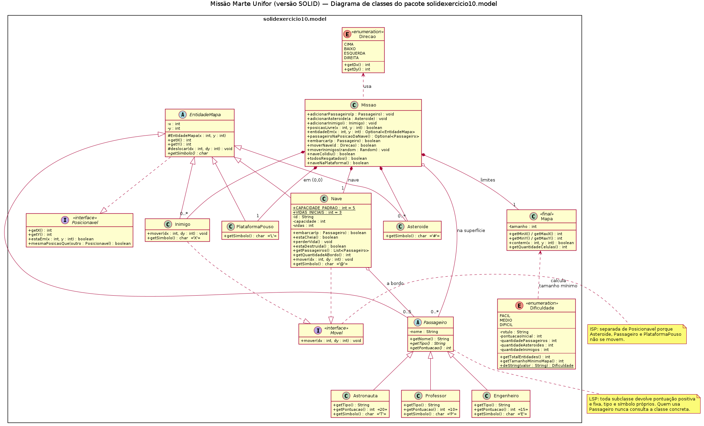
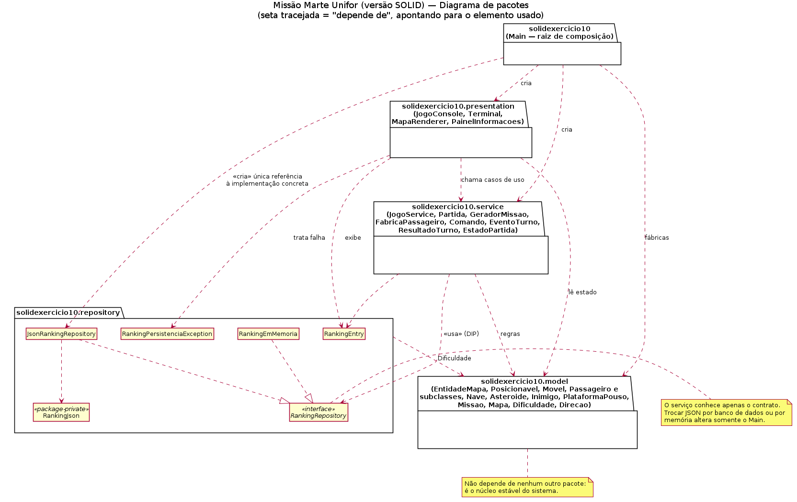

# Missão Marte Unifor — Refatoração SOLID

**Aluno:** Igor Damasceno Andrade — matrícula 2113413
**Disciplina:** Projeto e Arquitetura de Sistemas — UNIFOR
**Repositório:** https://github.com/IgorD-Andrade/missao-marte-solid-igor

Refatoração do jogo de console *Missão Marte Unifor* (`src/exercicio10`) aplicando os princípios SOLID. O código original foi **preservado sem alterações** para comparação; a versão refatorada está em `src/solidexercicio10`.

| Documento | Conteúdo |
|---|---|
| [`docs/ANALISE-INICIAL.md`](docs/ANALISE-INICIAL.md) | Responsabilidades da `Main` original, comportamentos a preservar e defeitos encontrados |
| [`REVISAO-SOLID.md`](REVISAO-SOLID.md) | Revisão crítica: observações por princípio, concordâncias, discordâncias, testes e prioridades |
| [`docs/uml/`](docs/uml/) | Diagramas UML (fonte `.puml` + imagem `.png`) |
| [`docs/evidencias/`](docs/evidencias/) | Saídas reais das execuções (original e refatorado) e dos testes |
| [`docs/ROTEIRO-APRESENTACAO.md`](docs/ROTEIRO-APRESENTACAO.md) | Roteiro da apresentação e perguntas prováveis |
| [`src/README.md`](src/README.md) | Tutorial do professor usado como referência |

---

## 1. Como compilar e executar

Requisito: **JDK 17 ou superior** (usa `switch` com `->` e `List.toList()`). Todos os comandos são executados na **raiz do repositório**.

### Linux / macOS (bash)

```bash
# versão original (para comparação)
javac -d out src/exercicio10/*.java
java -cp out exercicio10.Main

# versão refatorada
javac -d out $(find src/solidexercicio10 -name "*.java")
java -cp out solidexercicio10.Main

# mesma partida sempre (útil para demonstração): semente fixa
java -cp out solidexercicio10.Main --seed 5
```

### Windows (PowerShell)

```powershell
javac -d out src/exercicio10/*.java
java -cp out exercicio10.Main

javac -d out (Get-ChildItem -Recurse -Filter *.java src/solidexercicio10 | ForEach-Object FullName)
java -cp out solidexercicio10.Main
```

> Se os acentos aparecerem como `?` no Windows, execute `chcp 65001` antes ou use `java -Dstdout.encoding=UTF-8 ...`.

### Testes automatizados (sem JUnit, sem dependências)

```bash
javac -d out $(find src/solidexercicio10 test/solidexercicio10 -name "*.java")
java -cp out solidexercicio10.ExecutarTestes
```

Resultado atual: **39 testes, 39 sucessos** ([saída completa](docs/evidencias/08-testes-automatizados.txt)).

Para regenerar todas as evidências de execução: `bash docs/evidencias/gerar-evidencias.sh`.

### Como jogar

| Tecla | Ação |
|---|---|
| `w` `s` `a` `d` | mover para cima / baixo / esquerda / direita (custa 1 ponto) |
| `c` | embarcar o passageiro da posição atual |
| `q` | abortar a missão |

Resgate todos os passageiros (`P` Professor +10, `E` Engenheiro +15, `T` Astronauta +20), desvie de asteroides `#` e inimigos `X` (cada colisão tira 1 de 3 vidas) e volte à plataforma `L` em (0,0). O ranking fica em `ranking-solid-exercicio10.json` (a versão original usa `ranking.json`, então as duas não se misturam).

---

## 2. Estrutura da versão refatorada

```text
src/solidexercicio10/
├── Main.java                      raiz de composição: cria e conecta as dependências
├── model/                         domínio (não depende de nenhum outro pacote)
│   ├── Posicionavel, Movel        interfaces pequenas (ISP)
│   ├── EntidadeMapa               base abstrata com posição e símbolo
│   ├── Passageiro                 abstrata → Professor, Engenheiro, Astronauta
│   ├── Nave, Asteroide, Inimigo, PlataformaPouso
│   ├── Missao                     estado do mundo e movimentos dentro dos limites
│   ├── Mapa                       limites -n..+n (substitui minX/maxX/minY/maxY)
│   └── Dificuldade, Direcao       enums com seus próprios parâmetros
├── service/                       regras e casos de uso (sem console)
│   ├── JogoService                iniciar partida, ranking Top 5, reset
│   ├── Partida                    regras de um turno → ResultadoTurno
│   ├── GeradorMissao              povoa o mapa (sem laço infinito)
│   ├── FabricaPassageiro          ponto de extensão para novos passageiros (OCP)
│   └── Comando, EventoTurno, ResultadoTurno, EstadoPartida
├── presentation/                  console
│   ├── JogoConsole                menu e laço de interação
│   ├── Terminal                   leitura de entrada (trata fim de entrada)
│   ├── MapaRenderer               desenho do mapa e legenda
│   └── PainelInformacoes          textos: painel, mensagens, estatísticas, ranking
└── repository/                    persistência
    ├── RankingRepository          contrato (DIP)
    ├── JsonRankingRepository      implementação em arquivo JSON
    ├── RankingEmMemoria           implementação em memória (testes)
    ├── RankingJson                formato JSON (package-private)
    ├── RankingEntry               registro imutável
    └── RankingPersistenciaException
test/solidexercicio10/             39 testes + PilotoAutomatico (robô que planeja uma vitória)
```

Comparação rápida: a `Main` original tinha **557 linhas e 9 responsabilidades**; na versão refatorada a maior classe é o parser `RankingJson` (210 linhas, uma responsabilidade) e a `Main` tem 69 linhas, só de composição.

---

## 3. Alterações realizadas e princípios aplicados

| Princípio | Onde | O que foi feito |
|---|---|---|
| **SRP** | `Main` → 5 pacotes | Entrada (`Terminal`), desenho (`MapaRenderer`), textos (`PainelInformacoes`), regras do turno (`Partida`), criação do mapa (`GeradorMissao`), casos de uso (`JogoService`), formato do arquivo (`RankingJson`) e acesso a disco (`JsonRankingRepository`) viraram classes separadas. |
| **SRP** | `Partida` + `EventoTurno` | A regra devolve *eventos* (`COLISAO`, `NAVE_CHEIA`...) e a apresentação escolhe o texto. A regra não tem `System.out`. |
| **OCP** | `EntidadeMapa.getSimbolo()` | O renderizador não usa mais `instanceof`; um novo tipo aparece no mapa e na legenda sem alterar `MapaRenderer`. |
| **OCP** | `FabricaPassageiro` | Novo passageiro = nova subclasse + uma linha no `Main`. Comprovado pelo teste com um `Medico` criado só no teste. |
| **OCP** | `Dificuldade` | Pontuação inicial e quantidades ficam no próprio enum; acabaram os `switch`/`if` espalhados. |
| **LSP** | `Passageiro` | Classe abstrata com contrato documentado (pontuação positiva e fixa, tipo e símbolo). `Partida` soma `getPontuacao()` sem saber o tipo concreto. |
| **ISP** | `Posicionavel` / `Movel` | Quem só consulta posição não depende de `mover`. `Missao.moverDentroDoMapa` exige apenas `Posicionavel & Movel`. `RankingRepository` tem só os 3 métodos que o serviço usa. |
| **DIP** | `JogoService` → `RankingRepository` | O serviço recebe o contrato pelo construtor; só `Main` conhece `JsonRankingRepository`. O mesmo teste roda com JSON e com memória. |

### Comportamento preservado

Menu, textos, símbolos, pontuações (10/15/20), pontuação inicial por dificuldade (30/20/15), quantidades de entidades, capacidade 5, 3 vidas, custo de 1 ponto por movimento, regra de vitória na plataforma (0,0), Top 5 e formato do JSON (o arquivo do exercício 10 continua legível). A lista completa está em [`docs/ANALISE-INICIAL.md`](docs/ANALISE-INICIAL.md#2-comportamentos-que-precisam-continuar-funcionando).

### Mudanças de comportamento intencionais (correções)

| Situação | Original | Refatorado |
|---|---|---|
| Mapa tamanho 1 em Médio/Difícil | trava (laço infinito) | informa o tamanho mínimo e usa o padrão |
| Ctrl+D / fim da entrada | `NoSuchElementException` | aborta a partida e encerra normalmente |
| Nome do piloto com vírgula | registro perdido ao recarregar | salvo e carregado corretamente |
| Arquivo de ranking corrompido | sobrescrito sem aviso | preservado como `.corrompido` |
| Estatísticas | só na vitória | ao fim de qualquer partida (com o resultado) |

### Onde divergi do tutorial

O tutorial foi seguido na estrutura de pacotes, mas a implementação de referência tinha pontos que eu corrigi ou fiz diferente — todos justificados em [`REVISAO-SOLID.md`](REVISAO-SOLID.md): pontuações de Professor/Engenheiro/Astronauta estavam trocadas; o ranking era gravado em texto separado por `|` em vez de JSON; inimigos podiam sair do mapa; o `JogoService` misturava `Scanner`/`System.out` com regras; o reset não pedia confirmação; a interface do repositório tinha um método que ninguém usava; e a implementação se chamava `RankingService` estando no pacote `repository`.

---

## 4. Diagramas UML

Fontes em PlantUML; para regenerar as imagens: `plantuml -tpng -charset UTF-8 docs/uml/*.puml`.

### Diagrama de classes — `solidexercicio10.model`



Fonte: [`docs/uml/diagrama-classes-model.puml`](docs/uml/diagrama-classes-model.puml)

Decisões representadas:

- **Herança:** tudo que aparece no mapa estende `EntidadeMapa`, que realiza `Posicionavel`. `Passageiro` é abstrato e tem três subclasses concretas.
- **Realização seletiva (ISP):** só `Nave` e `Inimigo` realizam `Movel`.
- **Composição:** a `Missao` possui 1 `Mapa`, 1 `Nave`, 1 `PlataformaPouso` e 0..* `Asteroide`/`Inimigo` — eles não existem fora dela.
- **Agregação:** `Passageiro` é agregado e não composto porque **muda de dono**: começa na lista da `Missao` (superfície) e passa para a `Nave` (0..5 a bordo) no embarque.
- **Enums:** `Dificuldade` carrega os parâmetros de cada nível; `Direcao` carrega o deslocamento (dx, dy).

### Diagrama de pacotes



Fonte: [`docs/uml/diagrama-pacotes.puml`](docs/uml/diagrama-pacotes.puml)

Decisões representadas:

- As dependências apontam **para baixo, em direção ao `model`**, que não depende de ninguém.
- `service` depende da **interface** `RankingRepository`, nunca de `JsonRankingRepository` (DIP).
- Apenas o pacote raiz (`Main`) referencia a implementação concreta do repositório.
- `presentation` depende de `repository` apenas para exibir `RankingEntry` e tratar `RankingPersistenciaException` (ponto discutido na revisão).

---

## 5. Testes

- **Automatizados:** 39 testes em `test/solidexercicio10` cobrindo modelo, regras da partida, gerador, `JogoService`, repositório JSON e o console de ponta a ponta (inclusive uma partida inteira até a vitória, planejada por um robô). Detalhes em [`REVISAO-SOLID.md`](REVISAO-SOLID.md#testes-realizados).
- **Manuais / evidências:** saídas reais em [`docs/evidencias/`](docs/evidencias/), geradas pelo script `gerar-evidencias.sh`.

---

## 6. Limitações que permanecem

- `presentation` ainda depende de dois tipos do pacote `repository` (`RankingEntry` e a exceção); o ideal seria o serviço devolver um DTO próprio.
- O arquivo JSON guarda todas as vitórias que entraram no Top 5 no momento em que foram jogadas; o corte em 5 é feito na leitura (o arquivo pode crescer lentamente).
- O parser JSON é próprio e aceita apenas objetos "planos" (sem aninhamento), suficiente para este arquivo.
- O tempo de jogo é medido em segundos inteiros e inclui o tempo em que o jogador está pensando (igual ao original).
- A interface é somente console; não há testes de desempenho nem de concorrência (dois jogos gravando o mesmo arquivo ao mesmo tempo).
